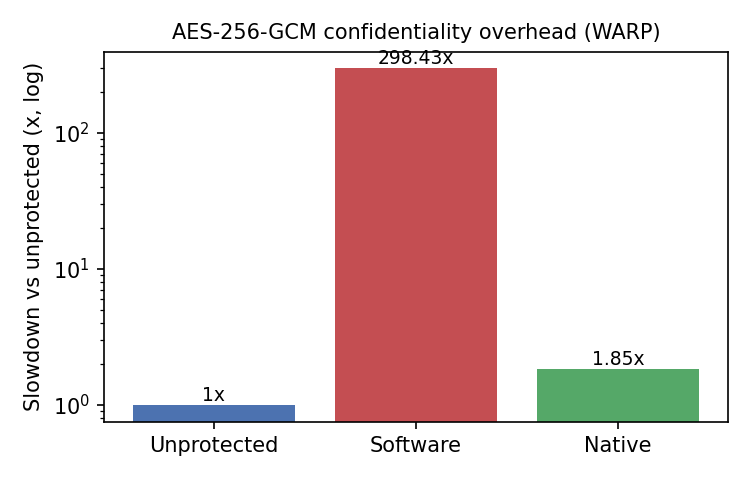
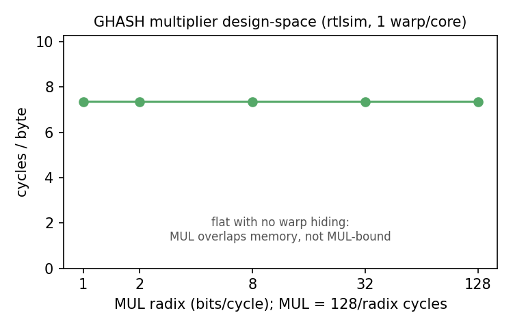
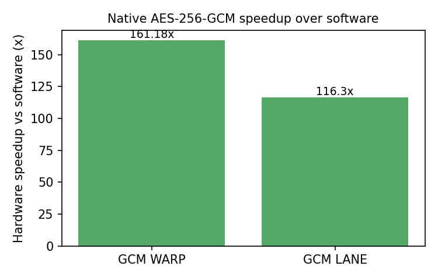
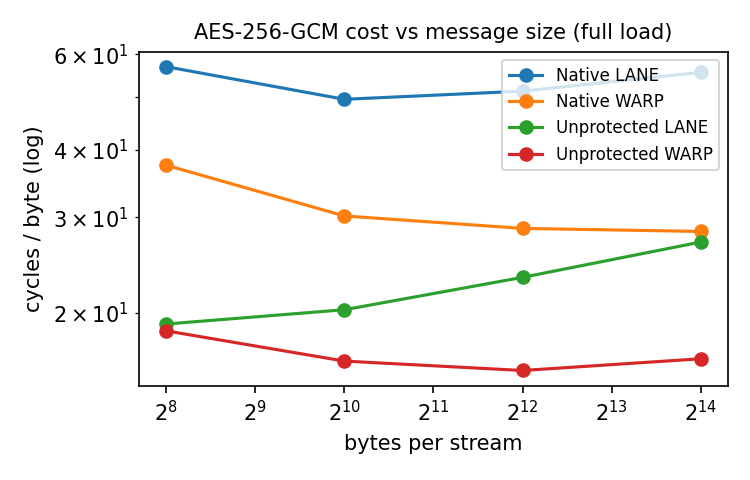
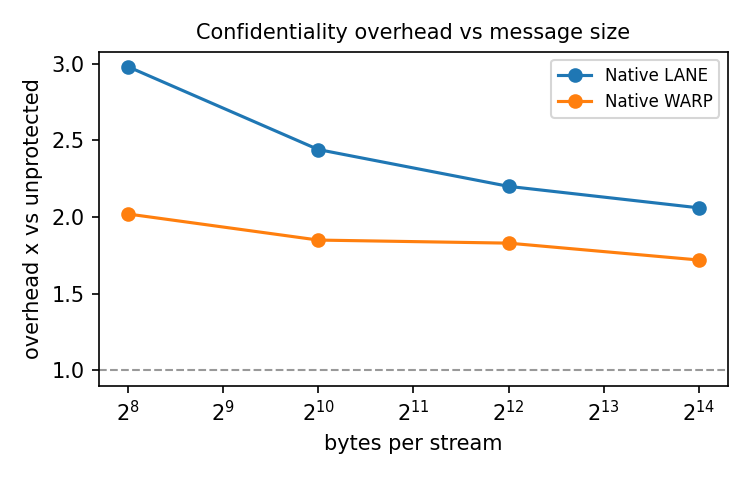

# Vortex crypto results

## AES-256-GCM confidentiality overhead

| accel_mode | dispatch | total_bytes | cycles | cyc_per_byte | overhead_x | native_speedup | status |
|---|---|---|---|---|---|---|---|
| UNPROTECTED | WARP | 32768 | 534359 | 16.307 | 1.00x |  | PASS |
| UNPROTECTED | LANE | 32768 | 655440 | 20.002 | 1.00x |  | PASS |
| SOFTWARE | WARP | 32768 | 159471158 | 4866.674 | 298.43x |  | PASS |
| SOFTWARE | LANE | 32768 | 193756669 | 5912.984 | 295.61x |  | PASS |
| NATIVE | WARP | 32768 | 989392 | 30.194 | 1.85x | 161.18x | PASS |
| NATIVE | LANE | 32768 | 1666012 | 50.843 | 2.54x | 116.30x | PASS |

## GHASH multiplier design-space (radix sweep)

| mul_radix | mul_cycles | total_bytes | cycles | cyc_per_byte | ipc | status |
|---|---|---|---|---|---|---|
| 1 | 130 | 32,768 | 110612 | 3.38 | 1.008480 | PASS |
| 2 | 66 | 32,768 | 108226 | 3.3 | 1.030714 | PASS |
| 8 | 18 | 32,768 | 108113 | 3.3 | 1.031791 | PASS |
| 32 | 6 | 32,768 | 110334 | 3.37 | 1.011021 | PASS |
| 128 | 3 | 32,768 | 107388 | 3.28 | 1.038757 | PASS |

## AES-256-GCM full-load size sweep

| accel_mode | dispatch | bytes_per_task | total_bytes | cycles | cyc_per_byte | gbps_1ghz | overhead_x | status |
|---|---|---|---|---|---|---|---|---|
| NATIVE | LANE | 256 | 32768 | 1864354 | 56.896 | 0.0176 | 2.98x | PASS |
| NATIVE | LANE | 1024 | 131072 | 6492985 | 49.538 | 0.0202 | 2.44x | PASS |
| NATIVE | LANE | 4096 | 524288 | 26889285 | 51.287 | 0.0195 | 2.20x | PASS |
| NATIVE | LANE | 16384 | 2097152 | 116490728 | 55.547 | 0.0180 | 2.06x | PASS |
| NATIVE | WARP | 256 | 8192 | 306845 | 37.457 | 0.0267 | 2.02x | PASS |
| NATIVE | WARP | 1024 | 32768 | 989392 | 30.194 | 0.0331 | 1.85x | PASS |
| NATIVE | WARP | 4096 | 131072 | 3754197 | 28.642 | 0.0349 | 1.83x | PASS |
| NATIVE | WARP | 16384 | 524288 | 14822367 | 28.271 | 0.0354 | 1.72x | PASS |
| UNPROTECTED | LANE | 256 | 32768 | 625424 | 19.086 | 0.0524 | 1.00x | PASS |
| UNPROTECTED | LANE | 1024 | 131072 | 2657972 | 20.279 | 0.0493 | 1.00x | PASS |
| UNPROTECTED | LANE | 4096 | 524288 | 12198945 | 23.268 | 0.0430 | 1.00x | PASS |
| UNPROTECTED | LANE | 16384 | 2097152 | 56684558 | 27.029 | 0.0370 | 1.00x | PASS |
| UNPROTECTED | WARP | 256 | 8192 | 151878 | 18.540 | 0.0539 | 1.00x | PASS |
| UNPROTECTED | WARP | 1024 | 32768 | 534359 | 16.307 | 0.0613 | 1.00x | PASS |
| UNPROTECTED | WARP | 4096 | 131072 | 2053766 | 15.669 | 0.0638 | 1.00x | PASS |
| UNPROTECTED | WARP | 16384 | 524288 | 8634458 | 16.469 | 0.0607 | 1.00x | PASS |

## Correctness

| suite | what | cases | result |
|---|---|---|---|
| ghash_smoke | GF(2^128) algebraic identities | 8 | PASS (sw+native, simx+rtlsim) |
| aes_gcm_smoke | NIST AES-256-GCM TC13-16 | 4 | PASS (sw+native, simx+rtlsim) |
| gcm_bench | sw vs native tag checksum | all | MATCH (bit-exact) |

## Figures

